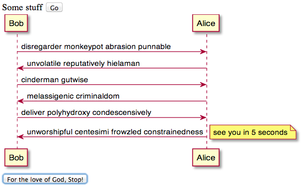

Spring boot server than belches out a random conversation between Alice and Bob.

Looks something like this:

Sequence diagram by [Plantuml](plantuml.sourceforge.net).

Browser updates from Server Sent Events ([EventSource](http://www.html5rocks.com/en/tutorials/eventsource/basics/))

Conversation dialogue from /usr/share/dict/words.